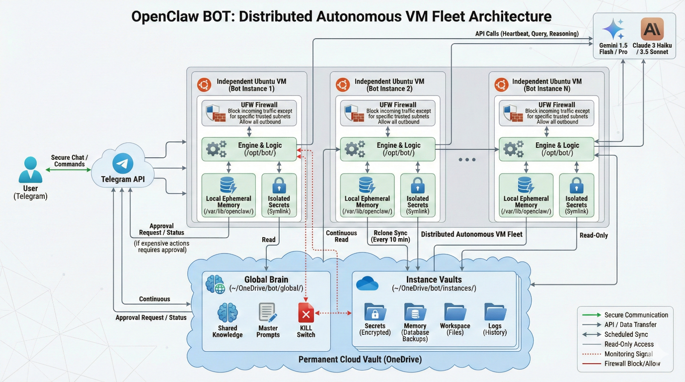

# OpenClaw BOT

A distributed autonomous bot fleet where every bot runs as an independent agent on its own dedicated Linux VM. Built for privacy, cost control, and resilience.

## What Is This?

OpenClaw BOT is an architecture for running AI-powered Telegram bots on a fleet of VMs. Each bot has:

- **Isolated secrets** — API keys and tokens never leave the individual bot
- **Shared knowledge** — A "Global Brain" on OneDrive for fleet-wide context
- **Cost controls** — Smart model routing (cheap models for simple tasks, expensive ones only with approval)
- **Safety guardrails** — Telegram-based approval system for admin actions, expensive models, and rule changes
- **A kill switch** — One file creation shuts down the entire fleet in 5 seconds

## Architecture

Each bot operates independently on an Ubuntu VM. Data persists to OneDrive via `rclone` sync. The bot communicates with users through Telegram and routes tasks to Gemini or Claude models based on complexity.

## Documentation

| Document | Description |
|----------|-------------|
| [DESIGN.md](./DESIGN.md) | Full architecture, memory model, security design, and operational guardrails |
| [DEPLOYMENT.md](./DEPLOYMENT.md) | Step-by-step deployment guide with all commands |

## Quick Start

1. Spin up a fresh Ubuntu 22.04+ VM
2. Follow [DEPLOYMENT.md](./DEPLOYMENT.md) — Phase 1 sets up infrastructure, Phase 2 configures OneDrive sync, Phase 3 loads the bot instructions
3. Message your bot on Telegram

## Tech Stack

- **Runtime:** Node.js 22 + OpenClaw Engine
- **AI Models:** Gemini 1.5 Flash/Pro (primary), Claude 3 Haiku/Sonnet (fallback)
- **Cloud Storage:** OneDrive via rclone
- **Communication:** Telegram Bot API
- **OS:** Ubuntu 22.04+
- **Firewall:** UFW with allowlisted subnets

## Cost Optimisation

Two built-in strategies keep token costs down:

- **QMD Skill:** Indexes local Markdown files and sends only relevant snippets to AI models (~95% token reduction)
- **Session Initialisation Rule:** Loads only essential files at startup (~8KB instead of ~50KB)

## Security Model

- All incoming traffic blocked by default (UFW)
- Secrets stored with `chmod 600` permissions
- Every expensive operation requires Telegram approval from a hardcoded User ID
- Global kill switch for emergency fleet shutdown

## Contributing

Open an issue or submit a PR. Feedback welcome.

## License

[Choose your license]
